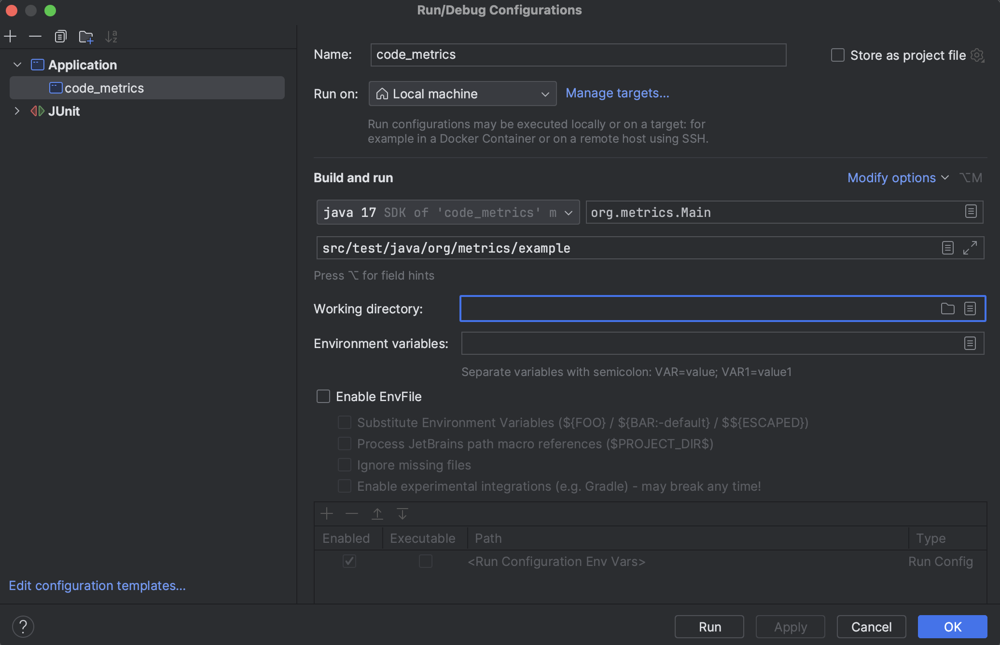

## How to run
```sh
git clone https://github.com/FChikh/code_metrics.git
cd code_metrics
mvn clean package
java -jar target/code_metrics-1.0-SNAPSHOT.jar src/test/java/org/metrics/example
```

or you can run it from IntelliJ IDEA, configuration - `code_metrics`, working directory - your path to repo folder:


## Tests

I added some simple tests to check logical functions of Metric & Style checkers, they can be executed with:

```sh
mvn test
```

## Simplified Code Complexity Metric

A proposed simplified code complexity metric counts conditional statements and is reminiscent of "Cyclomatic Complexity". It is a quantitative measure of independent paths in the source code of a software program. In other words, Cyclomatic Complexity helps to understand how many different possible paths to pass through the code exists.

Tom McCabe developed this metric in 1976 and introduced the following categorization of cyclomatic complexity:
- 1 - 10: Simple procedure, little risk
- 11 - 20: More complex, moderate risk
- 21 - 50: Complex, high risk
- \>50: Untestable code, very high risk

Simplifying this metric to the case of a simple procedure, we have a formula: `complexity = decisionPoints - exitPoints + 2`, where _decision points_ are branching conditions in procedure and _exit points_ are returns from function: this will be my formula to evaluate each method's complexity.

## Parsing Java Source Code

Before going to complexities, a very first task to solve — how to parse Java source code files. A very first idea — let us use Regular Expressions! Thus, this approach led to a lot of exceptions along the route. For example, one of the problems was to distinguish between function signature and reminiscent of her text commented.

Thus, I’ve decided to use an open-source solution [JavaParser](https://javaparser.org/). It’s a very powerful tool to parse Java methods and find the lines we are interested in, precisely — Conditional Statements, Loops, Exceptions and Returns.

## Complexity calculations and report

Counting logic is implemented in `CyclomaticComplexityVisitor` class: mostly, I consider each of conditional statements as +1 branching option for the program, with some exceptions:
- Switch-case has multiple branching at the same time; also there exists an edge case with «default»: if there is a default statement then the number of new branches is one less as every routine have to pass «default»
- Try-catch-finally: every catch adds a branching option, as well as finally.
- Void-type functions: for this type of functions we don’t need explicit returns. However, they still can be explicitly expressed in the procedure, and my algorithm of complexity measurement can fail with these functions due to inability to discover point in program with implicit `returns`.
- Exit Points: for simplicity, I consider only `return` statements as exit points or implicit return from void function. However, there could possibly exist other exit points such as Exception throws and `System.exit` calls.

`ComplexityMetric` class corresponds to preprocessing stage of Java files using JavaParser methods. Also, it generates a report with 3 most complex methods in specified directory. Every time `loadDirectory` is called, it resets the status of `ComplexityMetric` class: all saved methods with their complexities are erased.

## Code Style Check

Again, thanks to JavaParser, we can easily extract method names and check them with regular expression for correspondence to Java name convention (camelCase). 

However, there are some limitations to this solution. Of course, it is very easy to distinguish the name of a variable written in one case from the name in another; each case has its own peculiarity and for any line it will not be a homonym in different cases.

When it comes to the correct naming of methods, controversy ensues. For example, is the name lessorEqual correct? From the point of view of the camelCase standard, it complies with the rules, but carries less semantic load, unlike lessOrEqual. In such cases, the solution seems to me to ask the dictionary to check for the presence of parts of the method name there.

`StyleCheck` class corresponds to this part of task. It simply checks the name of method obtained with JavaParser functionality by regular expression of camelCase. Checker logic is isolated within inner static class `NamingConventionChecker`, it can be extended with additional methods for other naming convention checks. Every time `loadDirectory` is called, it resets the status of `StyleCheck` class: all saved methods with naming violations are erased.

## Other

`FileReader` class is an abstract class which serves as a reader of file in directories before passing them to analyzers, reduce code duplication form both `CyclomaticComplexityMetric` and `StyleChecker`. It accepts path as a parameter, which can be either relative or absolute; it has to be a directory path, not single file.